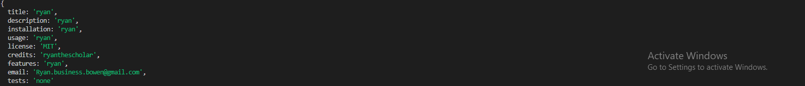

# README-Generator
- [WalkThrough link](https://youtu.be/qfiW5Khsq-s)

- [github repo](https://github.com/RyanTheScholar/README-Generator)

## Description

This project solves the problem of having to copy and paste templates online just to make a readme.md file. In fact I have made this file with the the same criteria as the generator itself.
Although not everything is covered in the readme.md generator its pretty close the only thing a user might need to do on their own time is make custom badges for the softwares used like Javascript, HTML, etc.... I learned how to use npm and different node modules to make this application function.

further notes about this application you may have to change the file path depending on where youre targeting the readme at or the images that you wish to link. If the file path is not correct it will not show properly. Note: I have ../ in the current file path to get to the images folder because of where the readme.md sample folder lies inside of the folder scheme.

## Table of Contents
  - [Installation](#installation)
  - [Usage](#usage)
  - [Credits](#credits)
  - [License](#license)
## Usage

  

## Installation
Git clone in git bash to access this file locally through your system.
## License

  

## features

## Questions

  - Ryan.business.bowen@gmail.com
  - [github](https://github.com/RyanTheScholar)

## Tests
N/A